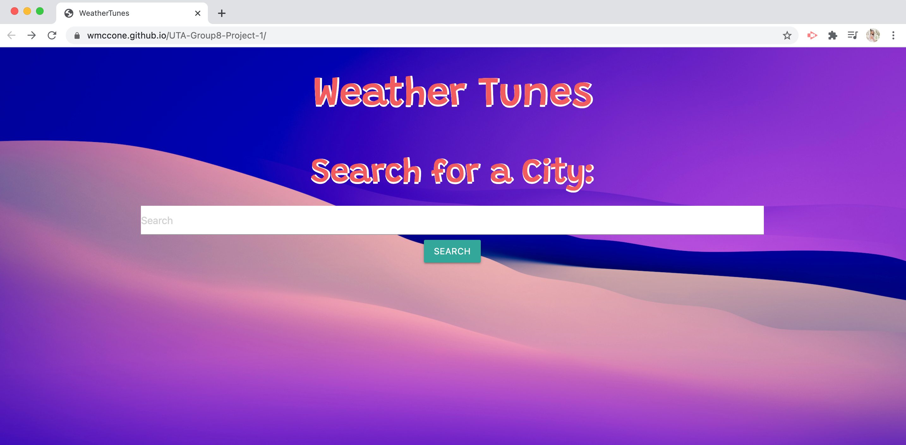
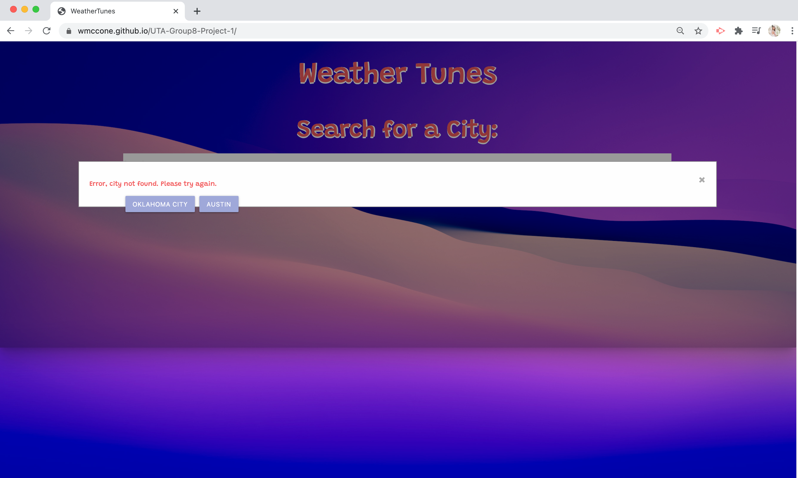

# WeatherTunes
This is an application collaboratively created in the UT-Austin Coding Bootcamp course.

## Description

WeatherTunes is an application that curates a playlist based on the user entered city current weather condition.

To get the weather forecast, the server-side [OpenWeather API](https://openweathermap.org/current) was used. When the user inputs a valid city name, the temperature, relative humidity, and wind speed of that city is displayed on the screen. The weather condition (i.e. sunny, thunderstorm, fog, etc.) is also used to display a corresponding background image and rain/snow feature when applicable.

The playlist was implemented using the server-side [YouTube API](https://developers.google.com/youtube/v3). By using the above mentioned weather condition, a search is initiated for a video with music matching that weather condition. The video is then displayed on the screen and can be played. 

Each valid city is stored into local storage and displayed as a new button on the page. This allows it to be clicked on again in the future and/or recalled when the page is refreshed. If a city is entered twice, it is only stored in local storage once. If the entered city is invalid, the user is given an error via a modal and returned to the initial home page.

[Materialize](https://materializecss.com/) was the framework used to style the page.

## Table of Contents

* [Installation](#installation)
* [Usage](#usage)
* [Credits](#credits)

## Installation

To install, pull repository and open html file in browser. Repository can be found here: [WeatherTunes Repo](https://github.com/wmccone/WeatherTunes)

Otherwise, the github page can be found here: [WeatherTunes Webpage](https://wmccone.github.io/WeatherTunes/)

## Usage

Below are screenshots of the page:

## Credits

This application was created collaboratively between [Walter McCone](https://www.linkedin.com/in/walter-mccone/), [Trace Suiter](https://www.linkedin.com/in/trace-suiter/), and [Jackie Pederson](https://www.linkedin.com/in/jackiehodgespederson/).

[OpenWeather API](https://openweathermap.org/current) and [YouTube API](https://developers.google.com/youtube/v3) were both used in this project.

The rain and snow animations were inspired from the following video: [Rain Animation YouTube](https://www.youtube.com/watch?v=kSQnT1mufN4&t=382s).

