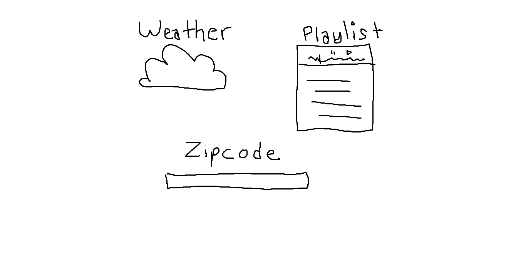

Project Name: 

WeatherTunes

Project description: 

Need motivation to study?? Is it snowing outside and you need to set the soundtrack to your life? WeatherTunes is an app that will take your zipcode look at the weather conditions outside and turn it into a playlist you can listen to. All you need to do is input your Zipcode and our app will give you the weather outlook and serve you a random playlist to go with the mood.

User Story: 

GIVEN I am a user
WHEN I enter my zipcode and submit to the page
THEN I am served the weather for my area

GIVEN I am the user
WHEN I submit a new location
THEN I am given a new weather condition/playlist

GIVEN I am a user
WHEN I see the weather on screen
THEN I am served a single curated playlist

GIVEN the user wants to control the song
WHEN I press the pause/skip button is pushed
THEN the music is paused/skipped

GIVEN the users background
WHEN my weather condition is fetched
THEN my background image changes to that weather condition

GIVEN I am the user
WHEN I input my location
THEN my location is saved to local storage when I return

WIREFRAME:

 

API's:

Spotify and/or Soundcloud
Openweather

Rough breakdown of tasks:

Jackie: Local storage / input forms
Trace: Music API / CSS
Michael: Background Images/ HTML
Walter: Weather API / Initial HTML structure

